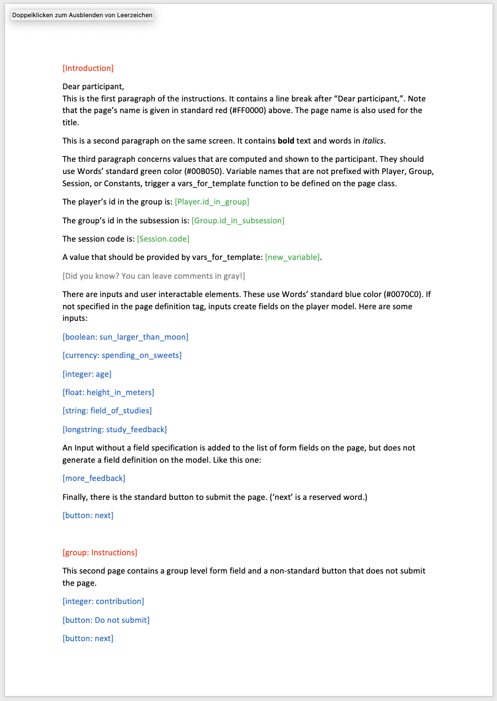

# oTree Template Generator
## Overview
oTree Template Generator is a small script that generates oTree page templates, page class definitions, as well as player and group class definitions from *.docx (Word) files.

It allows to intuitively write experimental instructions in Microsoft Word and then translate the file into code for use in oTree. 

## Usage
1. Write your experimental instructions using the markup described below. Save the file in docx format.
2. Then parse the file using oTree Template Generator
3. (To Do:) Actually write the files to disk, don't just print the contents.

```python
from otree_tg import Experiment

exp = Experiment('test_data/Example.docx')

if exp.player_fields:
    print(exp.render_player_class())

if exp.group_fields:
    print(exp.render_group_class())

for page in exp.pages:
    print(page.render_class())
    print(page.render_template())
```

## Markup
oTree Template Generator parses the Word files and uses an intuitive markup scheme based mostly on colors. Check the included Example.docx for a more detailed description.

### Pages
To define a page, write ```[Page_Name]``` and set the color to Word's standard red (<span style="color: #FF0000">#FF0000</span>). ```Page_Name``` will be used as the class name and as the heading of the page. To specify that inputs on the page are on the group, rather than the player level, you can write ```[group: Page_Name]``` and the page's ```form_model``` will be set accordingly. 

### Comments
To define a comment, write ```[Your comment]``` and set the color to grey (<span style="color: #808080">#808080</span>). Comments are rendered as template comments, such as ```{# Your comment #}```.

### Outputs
To output variables, write ```[Player.variable_name]``` and set the color to green (<span style="color: #00B050">#00B050</span>). Of course, Group and Session variables as well as Constants are also supported. If you do not specify a model class (i.e., ```[new_variable]```), a ```vars_for_template``` function is defined on the page class.

### Inputs
To let participants input information, write ```[field_name]``` and set the color to Word's standard blue (<span style="color: #0070C0">#0070C0</span>). ```field_name``` will be added to the page's list of ```form_fields```. If you specify the type (boolean, integer, float, currency, string, longstring) like this ```[integer: age]```, it will also generate the appropriate field definition on the Player (or Group) class.

### Buttons
Buttons are special inputs. To include the standard oTree next button, write ```[button: next]``` and set the color to Word's standard blue (<span style="color: #0070C0">#0070C0</span>). To include a button that does not submit the page, write anything but 'next' after the colon, i.e., ```[button: Do not submit!]```.

### Screenshot of example instructions document
